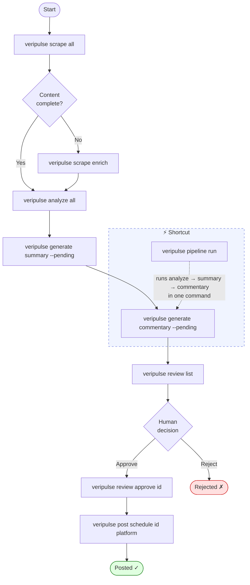

# Veripulse

Automated Philippine news aggregation, analysis, LLM commentary generation, and social media dissemination — with a human-in-the-loop review workflow.


---

## Overview

Veripulse scrapes Philippine news from free sources, analyzes each article (category, sentiment, importance), generates AI commentary via a local or remote Ollama model, routes articles through a human review step, then schedules or immediately publishes posts to Facebook and X/Twitter.

### Key features

| Feature | Detail |
|---------|--------|
| **Free news scraping** | DuckDuckGo News (primary), Google News RSS, configurable RSS feeds |
| **Cloudflare bypass** | Playwright headless browser fallback when sites return JS challenges |
| **Local or remote LLM** | Ollama on localhost or tunnelled over SSH (ProxyJump supported) |
| **NLP analysis** | Category, sentiment, importance score, trending score |
| **LLM content** | Bilingual (EN/Filipino) summaries and commentary |
| **Review workflow** | Every article must be approved before it can be posted |
| **Pipeline shortcut** | Single command to run analyze → summary → commentary |
| **Social publishing** | Facebook and X/Twitter; schedule or post immediately |

---

## Pipeline flowchart



### Article status lifecycle

```
raw ──► analyzed ──► generated ──► pending_review ──► approved ──► scheduled ──► posted
                                                  └──► rejected
```

| Status | Meaning |
|--------|---------|
| `raw` | Freshly scraped, not yet analyzed |
| `analyzed` | Category, sentiment, importance scored |
| `generated` | Summary created |
| `pending_review` | Commentary generated; awaiting human approval |
| `approved` | Human approved; ready to schedule |
| `rejected` | Human or bulk-rejected |
| `scheduled` | Social post queued for future publish |
| `posted` | Successfully published |

---

## Requirements

- **Python 3.10+**
- **[Ollama](https://ollama.ai/)** — local LLM inference (or SSH access to a remote host running Ollama)
- **SQLite** — included with Python
- Internet access for news scraping

---

## Installation

```bash
git clone https://github.com/jpdeleon/veripulse.git
cd veripulse
uv sync          # recommended
# or: pip install -e .
```

Install the Playwright browser (needed for sites behind Cloudflare):

```bash
uv run playwright install chromium
# or: playwright install chromium
```

---

## Setup

### 1. Configure secrets in `.env`

The `.env` file is gitignored — never commit real tokens.

```dotenv
# ── News APIs ────────────────────────────────────────────────────────────────
NEWSDATA_API_KEY=""        # newsdata.io — optional; DDG News works without it

# ── LLM ──────────────────────────────────────────────────────────────────────
OLLAMA_BASE_URL="http://localhost:11434"
OLLAMA_MODEL="qwen3.5:latest"
OLLAMA_SSH_HOST=""         # SSH hostname from ~/.ssh/config for remote Ollama
                           # Leave blank to use local Ollama

# ── Social media ─────────────────────────────────────────────────────────────
TWITTER_API_KEY=""
TWITTER_API_SECRET=""
TWITTER_ACCESS_TOKEN=""
TWITTER_ACCESS_SECRET=""

FACEBOOK_PAGE_ACCESS_TOKEN=""   # Generate at developers.facebook.com/tools/explorer
FACEBOOK_PAGE_ID=""             # Your Facebook Page numeric ID
```

### 2. Start Ollama (local)

```bash
# Pull a model
ollama pull qwen3.5:latest     # recommended
ollama pull llama3.2:3b        # lighter alternative

# Start the server
ollama serve
```

Or configure `OLLAMA_SSH_HOST` to use a remote machine — see [Remote Ollama over SSH](#remote-ollama-over-ssh).

### 3. Verify the connection

```bash
veripulse generate check
```

Expected output:
```
✓ Connected to Ollama at http://localhost:11434
  Model: qwen3.5:latest
  Temperature: 0.3
```

### 4. Check overall status

```bash
veripulse status main
```

---

## Quick start

### Option A — Step by step

```bash
# 1. Scrape news (DDG News by default, no API key needed)
veripulse scrape all --limit 20

# 2. Enrich articles that have missing content
veripulse scrape enrich

# 3. Analyze (categorize, sentiment, importance)
veripulse analyze all

# 4. Generate summaries + commentary
veripulse generate summary --pending
veripulse generate commentary --pending

# 5. Review
veripulse review list
veripulse review show <id>
veripulse review approve <id>

# 6. Schedule or post
veripulse post schedule <id> facebook
veripulse post now <id> facebook

# 7. Monitor
veripulse status queue
```

### Option B — Pipeline shortcut

For a single article (by ID or URL), run the full analyze → summary → commentary chain in one command:

```bash
# By article ID
veripulse pipeline run 42

# By URL (scrape with --full first if not already in DB)
veripulse scrape article --full https://newsinfo.inquirer.net/...
veripulse pipeline run https://newsinfo.inquirer.net/...

# Process all pending articles (up to --limit)
veripulse pipeline run --limit 5

# With language options
veripulse pipeline run 42 --bilingual   # EN + Filipino summary
veripulse pipeline run 42 --filipino    # Filipino commentary
```

The pipeline skips steps already completed, so re-running is safe.

---

## Command reference

### `veripulse scrape`

```bash
veripulse scrape all                        # Scrape all enabled sources
veripulse scrape all --limit 30             # Cap articles per source
veripulse scrape all --topic "DepEd"        # Override topic filter
veripulse scrape all --no-enrich            # Skip automatic enrichment
veripulse scrape enrich                     # Fetch full content for incomplete articles
veripulse scrape enrich --limit 50
veripulse scrape article <url>              # Scrape a single URL
veripulse scrape article <url> --full       # Include full body text
veripulse scrape rss <url>                  # Scrape a specific RSS feed
veripulse scrape sources                    # List configured sources
```

Scraping automatically retries with headless Chromium when a site returns a Cloudflare JS challenge.

### `veripulse analyze`

```bash
veripulse analyze all                       # Analyze all raw articles
veripulse analyze all --limit 100
veripulse analyze single <id>               # Analyze one article
veripulse analyze list                      # List analyzed articles
veripulse analyze list --category education
veripulse analyze list --sentiment negative
veripulse analyze stats                     # Category / sentiment breakdown
```

### `veripulse generate`

```bash
veripulse generate summary --pending                  # Summarize analyzed articles
veripulse generate summary <id>
veripulse generate summary --pending --bilingual      # EN + Filipino

veripulse generate commentary --pending
veripulse generate commentary <id>
veripulse generate commentary --pending --filipino

veripulse generate social <id> facebook               # Draft social post
veripulse generate social <id> twitter

veripulse generate check                              # Ping Ollama
```

### `veripulse pipeline`

```bash
veripulse pipeline run                      # Process all pending articles
veripulse pipeline run <id>                 # By article ID
veripulse pipeline run <url>                # By article URL
veripulse pipeline run --limit 10
veripulse pipeline run <id> --bilingual --filipino
```

### `veripulse review`

```bash
veripulse review list                                       # Pending articles by importance
veripulse review list --status analyzed
veripulse review show <id>                                  # Full details + commentary
veripulse review approve <id>
veripulse review reject <id>
veripulse review reject <id> --reason "off topic"
veripulse review edit <id> summary                          # Edit before posting
veripulse review edit <id> commentary
veripulse review bulk approve                               # Bulk approve
veripulse review bulk approve --min 0.7 --category education
veripulse review bulk reject
```

### `veripulse post`

```bash
veripulse post schedule <id> facebook                       # Schedule in 30 min (default)
veripulse post schedule <id> twitter --minutes 60
veripulse post now <id> facebook                            # Post immediately
veripulse post pending                                      # List scheduled posts
veripulse post pending --platform facebook
veripulse post cancel <post_id>
veripulse post bulk facebook --limit 5
veripulse post test facebook                                # Verify credentials
```

> **No LLM needed for scheduling** — `post schedule` reuses existing commentary. Ollama is only invoked if no prior content exists for the article.

### `veripulse status`

```bash
veripulse status main                       # Overview + Ollama status
veripulse status articles                   # Recent articles table
veripulse status articles --status approved
veripulse status queue                      # Pipeline work queue + next-step hints
veripulse status top                        # Top articles by importance score
veripulse status top --limit 20
```

### `veripulse db`

```bash
veripulse db stats                                      # Record counts by status
veripulse db delete --id 42
veripulse db delete --status rejected
veripulse db delete --source "DuckDuckGo News" --no-content
veripulse db delete --before 2025-01-01 --dry-run       # Preview without deleting
veripulse db delete --status raw --no-content -y        # Skip confirmation
```

---

## Configuration

`veripulse/config.yaml` holds non-secret settings. All secrets go in `.env`.

```yaml
scraping:
  interval_minutes: 60
  max_articles_per_run: 50
  timeout_seconds: 30
  retry_attempts: 3

news_sources:
  ddg_news:
    enabled: true     # Free, no API key, returns direct article URLs
  google_news:
    enabled: false    # Free RSS fallback
  newsdata:
    enabled: false
    api_key: ""       # Set NEWSDATA_API_KEY in .env
  rss:
    enabled: false
    feeds:
      - url: "https://www.philstar.com/rss/headlines"
        category: "general"

topics:              # DuckDuckGo News search terms
  - "Education Philippines"
  - "CHED scholarship"
  - "DepEd programs"

llm:
  provider: "ollama"
  base_url: "http://localhost:11434"
  host: ""           # Set OLLAMA_SSH_HOST in .env for remote Ollama
  model: "qwen3.5:latest"
  temperature: 0.3
  max_tokens: 2048

social:
  facebook:
    enabled: true
    page_access_token: ""   # Set FACEBOOK_PAGE_ACCESS_TOKEN in .env
    page_id: ""             # Set FACEBOOK_PAGE_ID in .env

editorial:
  require_full_review: true
  max_article_age_hours: 24
```

### Environment variables

| Variable | Description | Required |
|----------|-------------|----------|
| `OLLAMA_BASE_URL` | Ollama API URL | No (default: `http://localhost:11434`) |
| `OLLAMA_MODEL` | Model name | No (default: `qwen3.5:latest`) |
| `OLLAMA_SSH_HOST` | SSH hostname for remote Ollama | No |
| `NEWSDATA_API_KEY` | NewsData.io key | No (DDG News works without it) |
| `NEWSAPI_API_KEY` | NewsAPI.org key | No |
| `FACEBOOK_PAGE_ACCESS_TOKEN` | Facebook Page token | For Facebook posting |
| `FACEBOOK_PAGE_ID` | Facebook Page ID | For Facebook posting |
| `TWITTER_API_KEY` | Twitter API key | For Twitter posting |
| `TWITTER_API_SECRET` | Twitter API secret | For Twitter posting |
| `TWITTER_ACCESS_TOKEN` | Twitter access token | For Twitter posting |
| `TWITTER_ACCESS_SECRET` | Twitter access secret | For Twitter posting |

---

## Remote Ollama over SSH

If Ollama runs on a remote machine, set `OLLAMA_SSH_HOST` in `.env`:

```dotenv
OLLAMA_SSH_HOST="myserver"   # any hostname defined in ~/.ssh/config
```

Veripulse opens an SSH port-forward tunnel automatically before each LLM call and closes it when done. ProxyJump entries in `~/.ssh/config` are respected natively.

Commands that do **not** call the LLM — `scrape`, `analyze`, `review`, `post schedule` (when content exists), `status` — never open the tunnel.

To test the tunnel:

```bash
veripulse generate check
```

---

## Project structure

```
veripulse/
├── cli/
│   ├── main.py          # Typer app, command registration
│   ├── scrape.py        # scrape subcommands + Playwright fallback
│   ├── analyze.py       # analyze subcommands
│   ├── generate.py      # generate subcommands (requires Ollama)
│   ├── pipeline.py      # pipeline run (analyze → summary → commentary)
│   ├── review.py        # review subcommands
│   ├── post.py          # post subcommands
│   ├── status.py        # status subcommands
│   └── db.py            # db delete / stats
│
├── core/
│   ├── config.py        # Pydantic config + .env override logic
│   ├── database.py      # SQLAlchemy models
│   ├── logging.py       # Loguru setup
│   ├── scrapers/
│   │   └── news.py      # DuckDuckGoNewsScraper, GoogleNewsRSSScraper,
│   │                    # NewspaperScraper (httpx + Playwright fallback),
│   │                    # RSScraper, ScraperFactory
│   ├── analyzers/
│   │   └── nlp.py       # Categorizer, SentimentAnalyzer,
│   │                    # ImportanceScorer, TrendingDetector
│   ├── generators/
│   │   └── content.py   # SSHTunnel, LLMClient, Summarizer,
│   │                    # Commentator, SocialPostGenerator
│   └── publishers/
│       └── social.py    # FacebookPublisher, TwitterPublisher, PublisherFactory
│
├── services/
│   └── scheduler.py     # APScheduler background jobs
│
├── config.yaml          # Non-secret configuration (safe to commit)
├── .env                 # Secrets — gitignored, never commit
├── pyproject.toml
└── data/                # SQLite database + logs (gitignored)
    ├── veripulse.db
    └── veripulse.log
```

---

## Troubleshooting

### Ollama not reachable

```bash
# Local
ollama serve
curl http://localhost:11434/api/tags

# Remote SSH
veripulse generate check
```

### Article has no content after scraping

```bash
veripulse scrape enrich                       # batch enrichment
veripulse scrape article --full <url>         # single URL
```

Sites behind Cloudflare are automatically retried with Playwright. If a site remains unreachable it cannot be enriched without authentication.

### Facebook token invalid or expired

```bash
veripulse post test facebook
```

Tokens expire. Generate a new long-lived page token at [Facebook Graph API Explorer](https://developers.facebook.com/tools/explorer/) and verify it at [Access Token Debugger](https://developers.facebook.com/tools/debug/accesstoken/). Update `FACEBOOK_PAGE_ACCESS_TOKEN` in `.env`.

### Database cleanup

```bash
veripulse db stats
veripulse db delete --status rejected -y
veripulse db delete --no-content --dry-run    # preview before deleting

# Manual backup
cp data/veripulse.db data/veripulse.db.bak
sqlite3 data/veripulse.db "PRAGMA integrity_check;"
```

### Common errors

| Error | Cause | Fix |
|-------|-------|-----|
| `Cannot connect to Ollama` | Server not running | `ollama serve` |
| `model not found` | Model not pulled | `ollama pull <model>` |
| `403 Forbidden` | Site blocks scrapers | Playwright fallback runs automatically |
| `SSH tunnel did not become ready` | Host unreachable | Check `OLLAMA_SSH_HOST` and `~/.ssh/config` |
| `UNIQUE constraint failed` | Duplicate URL | Normal — article already in DB |

---

## Development

```bash
# Install with dev extras
uv sync --extra dev
# or: pip install -e ".[dev]"

# Lint
ruff check .

# Type check
mypy veripulse/

# Tests
pytest
pytest --cov=veripulse --cov-report=term-missing
```

---

## License

MIT — see [LICENSE](LICENSE) for details.
